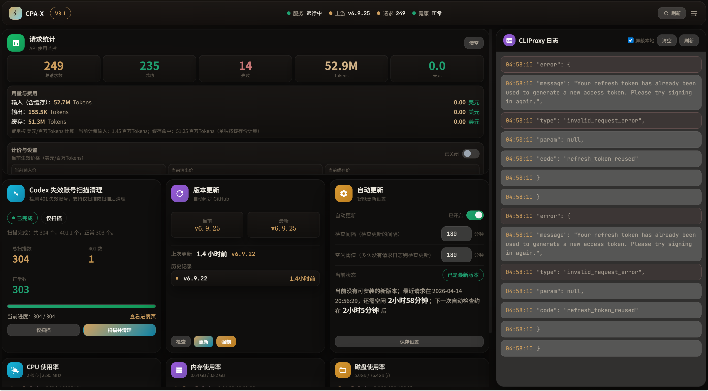

# CPA-XS Admin Panel (V3.1)

English | [中文](README_CN.md)

`CPA-XS` is a monitoring and management panel for `CLIProxyAPI / cliproxyapi`.  
This copy is prepared as a clean, shareable, deployment-ready package.

> **AI-first**: this repository is primarily intended for AI Agent deployment and operations rather than manual human-first setup.

## Project Origin

This repository is a modified derivative release.

- Original panel project: `CPA-X`  
  URL: `https://github.com/ferretgeek/CPA-X`
- Upstream service project: `CLIProxyAPI`  
  URL: `https://github.com/router-for-me/CLIProxyAPI`

`CPA-XS` is maintained as a customized build based on the original project, with practical adjustments to UI, deployment flow, and operational stability.

## Preview

### Dark Preview



### Light Preview


Features:
- service status and health checks
- request statistics, token and cost display
- logs and auth-file inspection
- model listing and API testing
- config view / validate / reload
- update check and auto-update
- three themes: light, paper, dark

## Requirements

- Recommended: Linux + systemd
- Python 3.11+
- A running `CLIProxyAPI / cliproxyapi`
- Access to the CPA management API (default `http://127.0.0.1:8317`)

Windows can run the panel, but `systemctl`-based features are limited.

## Fastest Install

### Linux
```bash
git clone https://github.com/liuxi8860-ctrl/CPA-XS.git
cd CPA-XS

cp .env.example .env
bash scripts/install.sh
python3 scripts/doctor.py --write-env

# Fill keys if doctor cannot infer them
nano .env

systemctl restart cliproxy-panel
systemctl status cliproxy-panel --no-pager
```

Open:
```text
http://your-server-ip:8080
```

### Windows
```powershell
git clone https://github.com/liuxi8860-ctrl/CPA-XS.git
cd CPA-XS
copy .env.example .env
powershell -ExecutionPolicy Bypass -File scripts/install.ps1
```

## Required Configuration

After copying `.env.example` to `.env`, verify these values:

- `CLIPROXY_PANEL_CLIPROXY_API_BASE`
- `CLIPROXY_PANEL_CLIPROXY_API_PORT`
- `CLIPROXY_PANEL_MANAGEMENT_KEY`
- `CLIPROXY_PANEL_MODELS_API_KEY`
- `CLIPROXY_PANEL_CLIPROXY_SERVICE`
- `CLIPROXY_PANEL_CLIPROXY_DIR`
- `CLIPROXY_PANEL_CLIPROXY_CONFIG`
- `CLIPROXY_PANEL_CLIPROXY_BINARY`
- `CLIPROXY_PANEL_CLIPROXY_LOG`
- `CLIPROXY_PANEL_AUTH_DIR`

If you are unsure about paths and service names:
```bash
python3 scripts/doctor.py --write-env
```

## Docker

Included:
- `Dockerfile`
- `docker-compose.yml`
- `.env.docker.example`

Quick start:
```bash
docker compose up -d --build
```

Container mode is best for monitoring and read-only operations, not for systemd-based service control.

## Security

- Do not commit `.env`
- Keep keys only in `.env`
- Main config write-back is disabled by default
- You can protect panel APIs with `CLIPROXY_PANEL_PANEL_ACCESS_KEY`

## Included Docs

- Human quick-start: `DEPLOY_QUICKSTART_CN.md`
- AI deployment notes: `AI_DEPLOY_CN.md`
- Release notes: `RELEASE_NOTES_V3.1.md`

## License

MIT License
